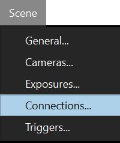
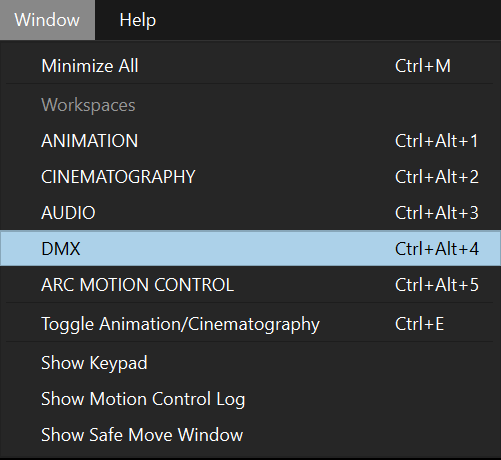

# :traffic_light: dmx-hue

[](https://www.npmjs.com/package/dmx-hue)
[](https://github.com/davpeet/dmx-hue/actions)

[](https://github.com/sindresorhus/xo)
[](LICENSE)


> Art-Net node to control Philips Hue lights with DMX

This updated version of DMX-HUE supports 5 channels per light allowing you to control the brightnes and colour temperature. This was primarily implemented to allow control of Philips Hue lights from DragonFrame stopmotion animation software. 

## Installation

Install [NodeJS](https://nodejs.org), then open a command prompt:

```bash
npm install -g davpeet/dmx-hue
```

## Usage

```
Usage: dmx-hue [setup] [options]

Create an ArtNet DMX<>Hue bridge.

Options:
  -h, --host       Host address to listen on              [default: '0.0.0.0']
  -a, --address    Set DMX address (range 1-511)          [default: 1]
  -u, --universe   Art-Net universe                       [default: 0]
  -t, --transition Set transition time in ms              [default: 100]
                   Can also be set to 'channel' to enable a dedicated DMX
                   channel on which 1 step equals 100ms.
  -c, --colorloop  Enable colorloop feature
                   When enabled, setting all RGB channels of a light to 1 will
                   enable colorloop mode.
  -n, --no-limit   Disable safety rate limiting
                   Warning: when this option is enabled, make sure to not send
                   more than <number_of_lights>/10 updates per second, or you
                   might overload your Hue bridge.

Note: options overrides settings saved during setup.

Commands:
  setup            Configure hue bridge and DMX options
    -l, --list     List bridges on the network
    -i, --ip       Set bridge IP (use first bridge if not specified)
    --force        Force bridge setup if already configured
```

### Setup

Before being able to control Hue lights on your network, your first have to setup your Hue bridge with the app.
Run `dmx-hue setup`, press the **link button** on your Hue bridge within 30s, then run `dmx-hue setup` again.

After that, follow instructions to configure the default settings.
You can change these settings later at anytime by running `dmx-hue setup` again.

Once your Hue bridge is correctly setup, just run `dmx-hue` to start the Art-Net node, then go crazy with your
favorite DMX controller! :bulb:

If you're looking for a nice cross-platform & open-source DMX software controller, you should take a look at
[QLC+](http://www.qlcplus.org/).

#### Setting lights order

If you need to define your lights order manually for the DMX mapping, edit your configuration file with a text editor
(the file path is displayed at the end of `dmx-hue setup`) and add a new `lightsOrder` entry at the end like this:
```js
{
  ...
  "lightsOrder": [1, 2, 3]  // Hue lights ID
}
```

The Hue lights IDs are displayed when `dmx-hue` is started.

### Hue lights specific features

#### Supported Hue light states 
Each light has 5 channels  
1=Red (0-255)  
2=Green (0-255)   
3=Blue (0-255)  
4=Brightness (0-255) 0=off  
5=ColorTemp (77-250) ct value range for Philips Hue lights is 153-500. 8bit ColorTemp value multipled by 2 to convert  

#### Colorloop

When colorloop option is enabled, your can enable Hue light automatic colorloop mode by setting the R/G/B channels of
a given light to the value `1`.

#### Transition time

Hue light can automatically perform transitions from one state to another in a specified time. This is especially
useful since there is a somewhat low update rate limitation on Hue lights (see next section for more details). If you
want to go creative and be able to adjust transition times dynamically, you can dedicate a DMX channel for it.

## Philips Hue response times vs DMX

With the Philips Hue API it’s only possible to update the state of bulbs 10 times per second, 1 bulb at a time.
Compared to a single DMX universe, which controls all 512 individual parameters up to 44 times per second, there’s
some major differences in how quickly we can update your lights using this software bridge.

This is especially noticeable when using automation sequences, if you try to update Hue lights quicker than 0.1s times
the number of lights in your projects, some updates may be skipped. This is unfortunately a limitation with the Hue
lights API and I cannot do anything about that.

### Safety rate limiting

By default, a safety rate limit is enforced so there is always a 0,1s interval between Hue API calls. You can disable
this limit using the `--no-limit` option, but then you have to make sure to not make more than *number_of_lights / 10*
DMX value changes per second, or your Hue bridge might get overloaded.

### Integration with DragonFrame
The easiest way to use dmx-hue with DragonFrame is to run nodejs on the local machine running DragonFrame. On Windows follow these steps:  
* Install Nodejs for Windows from the official Web site: https://nodejs.org/en/download/
* Get the node package from GitHub using npm:  
```bash
npm install -g davpeet/dmx-hue
```
* Configure dmx-hue by pressing the button on the Hue bridge and running:  
```bash
node dmx-hue setup --ip <IP Address of Hue bridge>
```
* Configure DMX-HUE and the lights you want to use in DragonFrame in the setup:
```
Bridge configured at 192.168.1.101
? Set DMX address (range 1-511) 1
? Set Art-Net universe 0
? Enable huestateloop feature No
? Use DMX channel for transition time No
? Set transition time in ms 1
? Choose lights to use (Press <space> to select, <a> to toggle all, <i> to inverse selection)
 (*) Studio spot 1
 (*) Studio spot 2
 ( ) Stair light1
>( ) Pantry light
 ( ) Vitrine
 ( ) Christmas star
 ( ) Christmas lights
```
> [NOTE:]  
Earlier versions of DragonFrame communicate with ArcNet using an offset Universe Number i.e. dmx-hue configure on universe 0, DragonFrame configured with universe 1  
>

* Start dmx-hue:  
```  
c:\users\joe\node_modules\dmx-hue\bin>node dmx-hue  

DMX addresses on universe 0:
 1: Studio spot 1 (Hue ID: 33) Color temperature light
 6: Studio spot 2 (Hue ID: 34) Color temperature light

ArtNet node started (CTRL+C to quit)
```
* Start DragonFrame
* Open a scene and then select scene->connections  



* Add a new ArtNet connection on 127.0.0.1:0 (localhost ArtNet Universe 0)  


* Open the DMX Window Crtl+Alt+4  



* Add new Fixtures: Generic | RGBWW Fader:  


 * Once fixtures have been added select all fixtures. Right click and select Direct DMX Mode 0-255.  


* You can now control your Philips Hue lights from DragonFrame and use KeyFrames to implement transitions

Have fun animating with DragonFrame and DMX-HUE

Many thanks to [Yohan Lasorsa](https://github.com/davpeet) who created DMX-HUE